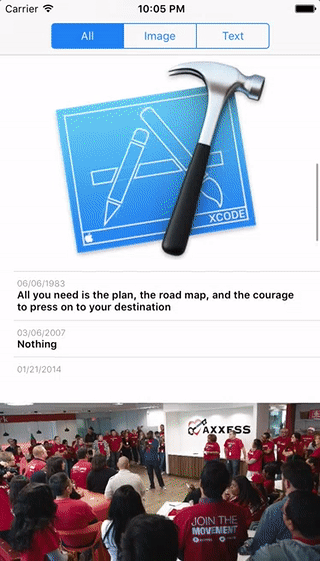

# AxxessChallenge_Lu
This is a Swift App, download and display contents of a list.

There two types of content: text and image. 

Height of cells are calculated with respect to the content height.

### Demo

